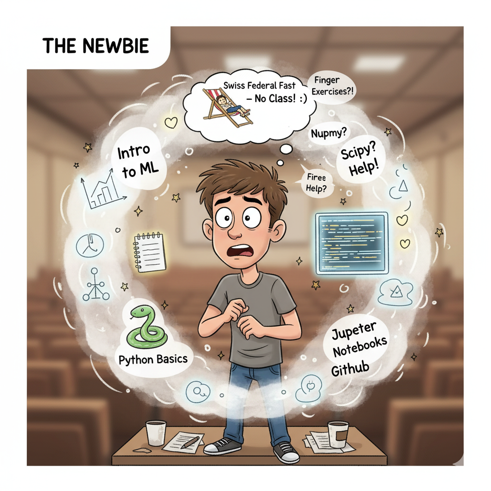
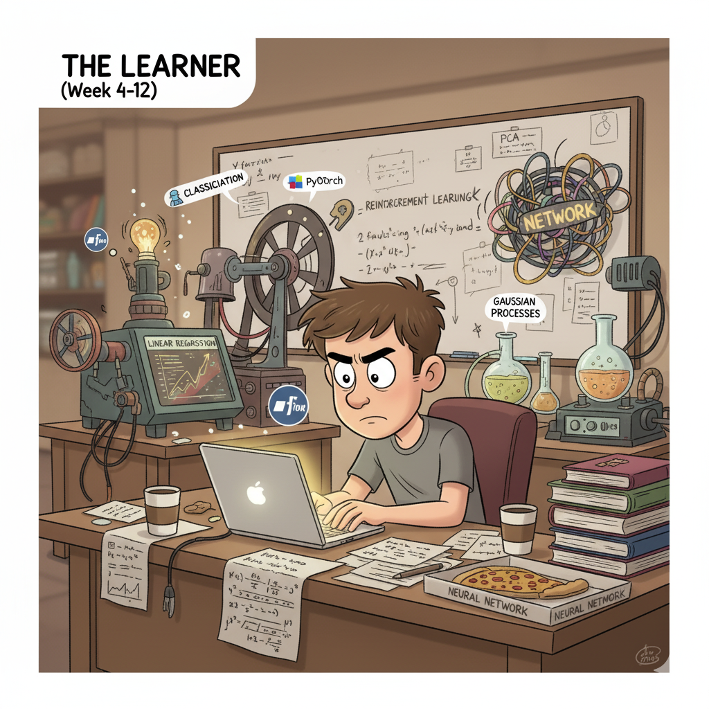
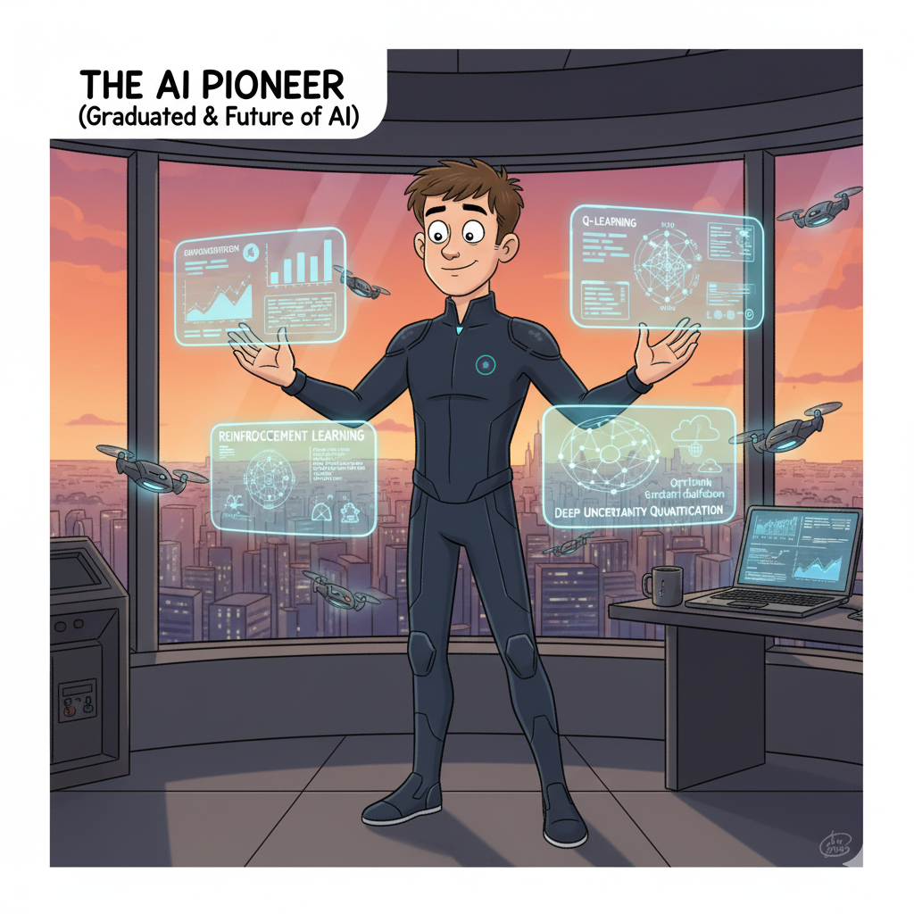
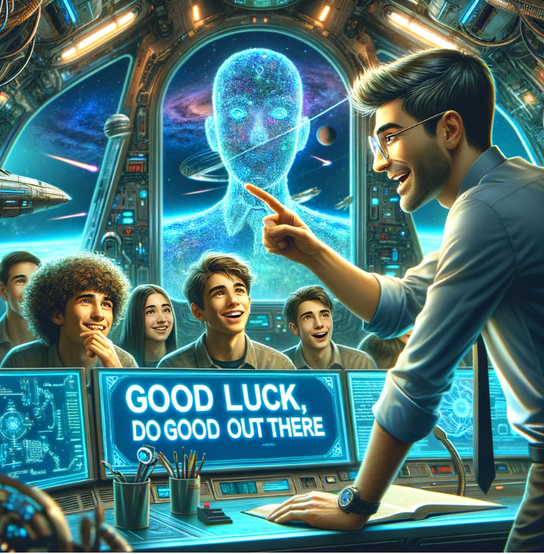

# Advanced Data Analytics, HEC Lausanne, Fall Semster 2025

> **Data Scientist (n.):** *Person who is better at statistics than any software engineer and better at software engineering than any statistician.*

* This is a 14-week Master’s level course on machine learning, offered at HEC Lausanne during the Fall Semester 2025 (Monday, September 15 - Monday, December 15, 2025).
* The course format consists of three 45-minute lecture sessions, followed by a 45-minute hands-on session at the end of each lecture.

### Meeting time and location

* Meeting time: Mondays, 10:15 - 12:00; 16:30 - 18:00
* Where:  Internef 126 (10:15 - 12:00); Anthropole 3185 (16:30 - 18:00)

### TA sessions:

* A weekly hands-on session is held on Mondays from 17:15 to 18:00, led by the teaching assistant, Maria Pia Lombardo.
* Individual TA sessions can be arranged via email and take place on Fridays upon request.

## Class enrollment on the [Nuvolos Cloud](https://nuvolos.cloud/)

* All lecture materials (slides, codes, and further readings) will be distributed via the [Nuvolos Cloud](https://nuvolos.cloud/).
* To enroll in this class, please click on this [enrollment key](https://app.nuvolos.cloud/enroll/class/sBsa1T_Mm5Y), and follow the steps.

### Video to get started with Nuvolos 

* First steps on Nuvolos: 

<iframe src="https://player.vimeo.com/video/513310246" width="640" height="360" frameborder="0" allow="autoplay; fullscreen; picture-in-picture" allowfullscreen></iframe>

## Course Objectives

* The objective of the course is to gain practical familiarity with current computer-aided data analysis and machine-learning approaches.

* We will study various machine learning methods in the context of:
    - supervised machine learning (classification and regression). 
    - unsupervised machine learning.
    - reinforcement learning (if time permits).

* The lectures will be interactive, in a workshop-like style, that is, a mix of theory and actively playing with code examples (delivered in Python and deployed on a cloud computing infrastructure).

## Prerequisites

* Basic econometrics.
* Basic programming in Python (see [this link](https://python-programming.quantecon.org/intro.html) for a thorough introduction).
* Basic calculus and probability ([Mathematics for Machine learning](https://mml-book.github.io/) provides a good overview of skills participants are required to be fluent in).

## Approximate schedule

Witness the incredible transformation of a student throughout the Machine Learning course, from a blank slate to a pioneer in AI!

<table style="width:100%; border:0px;">
  <tr>
    <td style="width:33%; vertical-align:top; border:0px;">
      <h3 align="center">Figure 1: The Newbie (Weeks 1-3)</h3>
      

        
      

    </td>
    <td style="width:33%; vertical-align:top; border:0px;">
      <h3 align="center">Figure 2: The Learner (Weeks 4-12)</h3>
      

        
      

    </td>
    <td style="width:34%; vertical-align:top; border:0px;">
      <h3 align="center">Figure 3: The AI Pioneer (Graduated & Future)</h3>
      

        
      

    </td>
  </tr>
</table>

### [Week 1](lectures/lecture_1), Monday, September 15th, 2025 (10:15 - 12:00; 16:30 - 18:00)

* **Get up to speed -- week 1**.
    - Topics:
        - [Introduction to Machine Learning](lectures/lecture_1/slides/Advanced_Data_Analytics_2025_lecture_1a.pdf) 
        - [A brief setup session on Nuvolos](lectures/lecture_1/slides/Advanced_Data_Analytics_2025_lecture_1b.pdf)

### [Week 2](lectures/lecture_2), Monday, September 22th, 2025 (10:15 - 12:00; 16:30 - 18:00)   

* **No Class: Swiss Federal Fast, Public Holiday**
        
### [Week 3](lectures/lecture_3), Monday, September 29th, 2025 (10:15 - 12:00; 16:30 - 18:00)

* **Get up to speed -- week 2**.
    - Topics:
        - [A crash course on Programming in Python](lectures/lecture_3/slides/Advanced_Data_Analytics_2025_lecture3a.pdf)
        - [Introduction to Jupyter Notebooks](lectures/lecture_3/code_notebooks/jupyter_intro.ipynb)
        - [A brief introduction to GitHub (quick tour; self-study)](lectures/lecture_3/slides/Advanced_Data_Analytics_2025_lecture_3b.pdf) 
        - [Finger exercises (at the end of the lecture; self-study)](lectures/lecture_3/Finger_exercises/finger_exercises_lecture_3.pdf)        
        - [Introduction to Numpy (quick tour; self-study)](python_refresher/python_basics_9_numpy_linalg.ipynb)
        - [Introduction to Scipy (quick tour; self-study)](lectures/lecture_3/code_notebooks/introduction_to_scipy.ipynb)
* [Distribution of Exercise sheet 1](exercises/Exercise_1/Problem_set_1.pdf)

### [Week 4](lectures/lecture_4), Monday, October 6th, 2025 (10:15 - 12:00; 16:30 - 18:00)

* [Lecture slides, week 4](lectures/lecture_4/slides/Advanced_Data_Analytics_2025_lecture4.pdf) 
    - Topics:
        - Supervised Learning - the general idea
        - Linear Regression (with multiple variables) 
        - Gradient Descent
        - Polynomial Regression 
        - Tuning Model Complexity
        - [Stock Market Prediction (if time permits)](lectures/lecture_4/demo/Stock_prediction_ML_Lecture4.ipynb)        
        - [Introduction to Pandas (quick tour; self-study)](python_refresher/python_basics_10_python_data_analysis_lib.ipynb)
        - [Discussion of the previous exercises; Finger exercises (with TA)](lectures/lecture_4/Finger_exercises/finger_exercises_lecture_4.pdf)                
* [Distribution of Exercise sheet 2](exercises/Exercise_2/Problem_set_2.pdf)

### [Week 5](lectures/lecture_5), Monday, October 13th, 2025 (10:15 - 12:00; 16:30 - 18:00)

* Intermezzo: a dedicated hands-on session on programming with Generative AI (LLMs) and autonomous agents, taught by Anna Smirnova.
* [Lecture slides, week 5](lectures/lecture_5/slides/Advanced_Data_Analytics_2025_lecture_5.pdf) 

### [Week 6](lectures/lecture_6), Monday, October 20th, 2025 (10:15 - 12:00; 16:30 - 18:00)

* [Lecture slides, week 6](lectures/lecture_6/slides/Advanced_Data_Analytics_2025_lecture_6.pdf) 
    - Topics:
        - Supervised Learning: Classification
        - k-Nearest-Neighbours
        - How to evaluate Classifiers
        - Naive Bayes
        - Decision Trees 
        - Combining Models (Boosting, Bagging -- if time permits) 
        - [Introduction to matplotlib (if time permits)](python_refresher/python_basics_11_basic_plotting.ipynb)
        - [Discussion of the previous exercises; Finger exercises (with TA)](lectures/lecture_6/Finger_exercises/finger_exercises_lecture_6.pdf)                                
* [Distribution of Exercise sheet 3](exercises/Exercise_3/Problem_set_3.pdf)        

### [Week 7](lectures/lecture_7), Monday, October 27th, 2025 (10:15 - 12:00; 16:30 - 18:00)

* [Lecture slides, week 7](lectures/lecture_7/slides/Advanced_Data_Analytics_2025_lecture_7.pdf) 
    - Topics:
        - Deep learning basics
        - Multi-layer perceptron 
        - Feed-forward networks
        - Network training - SGD
        - Error back-propagation
        - Some notes on overfitting
        - [Introduction to Tensorflow, applied to supervised machine learning problems](lectures/lecture_7/demo/03_Gentle_DNN.ipynb)
        - Discussion of the previous exercises (with TA)      
* [Distribution of Exercise sheet 4](exercises/Exercise_4/Problem_set_4.pdf)

### [Week 8](lectures/lecture_8), Monday, November 3rd, 2025 (10:15 - 12:00; 16:30 - 18:00)

* [Lecture slides, week 8](lectures/lecture_8/slides/Advanced_Data_Analytics_2025_lecture8.pdf) 
    - Topics:
        - [Warm-up with Tensorflow: Approximate analytical functions](lectures/lecture_8/demo/approx_analytical_function.ipynb)        
        - [A comprehensive Tour to Tensorflow](lectures/lecture_8/demo/04_TF_tour.ipynb)    
        - [Introduction to PyTorch, applied to supervised machine learning problems](lectures/lecture_8/demo/Intro_to_PyTorch.ipynb)
        - [Introduction to Deep Learning for Sequence Modeling (Recurrent Neural Networks, LSTMs, and a first glimpse into self-attention)](lectures/lecture_8/slides/Advanced_Data_Analytics_2025_lecture8.pdf)
        - [LSTMs applied to Ozone time series data, and stock prices (I)](lectures/lecture_8/demo/05_RNN_intro.ipynb)
        - [Discussion of the previous exercises; Finger exercises (with TA)](lectures/lecture_8/Finger_exercises/finger_exercises_lecture_8.pdf)                                        
* [Distribution of Exercise sheet 5](exercises/Exercise_5/Problem_set_5.pdf)

### [Week 9](lectures/lecture_9), Monday, November 10th, 2025 (10:15 - 12:00; 16:30 - 18:00)

* **Recap week** -- the most important concepts of the first 8 weeks will be reviewed, and open questions discussed so that no one is left behind
    - Topics:
        - [Recap of Supervised Machine Learning: Regression](lectures/lecture_9/demo/01_recap_supervised_learning_regression.ipynb)
        - [Recap of Supervised Learning: Classification](lectures/lecture_9/demo/02_recap_supervised_learning_classification.ipynb)
        - [Recap of Stochastic Gradient Descent](lectures/lecture_9/demo/03_GradientDescent_and_StochasticGradientDescent.ipynb)
        - [Feed-forward networks](lectures/lecture_9/demo/04_recap_deep_learning.ipynb)
        - [Sequence Modeling with Neural Networks (RNNs, LSTMs)](lectures/lecture_9/demo/05_recap_LSTM.ipynb)
        - [Applications in NLP (at the end of the lecture; self-study)](lectures/lecture_9/slides/Advanced_Data_Analytics_2025_lecture_9.pdf)
        - Discussion of the previous exercises (with TA)                                      
        
### [Week 10](lectures/lecture_10), Monday, November 17th, 2025 (10:15 - 12:00; 16:30 - 18:00)

* [Lecture slides, week 10](lectures/lecture_10/slides/Advanced_Data_Analytics_2025_lecture_10.pdf) 
    - Topics:
        - Gaussian Process regression 
        - Kernels with noise
        - Option-pricing examples (if time permits)
        - GP classification (self-study)
        - [Finger exercises part 1 (at the end of the lecture (with TA))](lectures/lecture_8/Finger_exercises_a/finger_exercises_lecture_10.pdf)                                                
        - [Finger exercises part 2 (at the end of the lecture (with TA))](lectures/lecture_8/Finger_exercises_b/finger_exercises_lecture_10.pdf)                                                        
* [Distribution of Exercise sheet 6](exercises/Exercise_6/Problem_set_6.pdf)
        
### [Week 11](lectures/lecture_11), Monday, November 24th, 2025 (10:15 - 12:00; 16:30 - 18:00)

* [Lecture slides, week 11](lectures/lecture_11/slides/Advanced_Data_Analytics_2025_lecture_11.pdf) 
    - Topics:
        - The curse of Dimensionality 
        - Bayesian active learning        
        - Active Subspaces and Gaussian Process Regression
        - Principal Component Analysis
        - [Discussion of the previous exercises; Finger exercises (with TA)](lectures/lecture_11/Finger_exercises/finger_exercises_lecture_11.pdf)                                                                
* [Distribution of Exercise sheet 7](exercises/Exercise_7/Problem_set_7.pdf)
        
### [Week 12](lectures/lecture_12), Monday, December 1st, 2025 (10:15 - 12:00; 16:30 - 18:00)

* [Lecture slides, week 12](lectures/lecture_12/slides/Advanced_Data_Analytics_2025_lecture_12.pdf) 
    - Topics:
        - k-Means
        - Gaussian Mixture Models 
        - Expectation Maximization 
        - Hierarchical Clustering
        - Density-based Clustering 
        - [Discussion of the previous exercises; Finger exercises (with TA)](lectures/lecture_12/Finger_exercises/finger_exercises_lecture_12.pdf)                                                                        
* [Distribution of Exercise sheet 8](exercises/Exercise_8/Problem_set_8.pdf)

### [Week 13](lectures/lecture_13), Monday, December 8th, 2025 (10:15 - 12:00; 16:30 - 18:00)

* [Lecture slides, week 13](lectures/lecture_13/slides/Advanced_Data_Analytics_2025_lecture_13.pdf) 
    - Topics:
        - [Introduction to Reinforcement learning (RL)](lectures/lecture_13/slides/Advanced_Data_Analytics_2025_lecture_13.pdf)
        - [A notebook on RL basics](lectures/lecture_13/demo/rl-basics.ipynb)        
        - [A notebook on Q learning](lectures/lecture_13/demo/q-learning.ipynb)                        
        - [RL: Optimal portfolio choice application](lectures/lecture_13/demo/Least_square_interpolation_Markowitz.ipynb)       
        - Discussion of the previous exercises (with TA)
                
### [Week 14](lectures/lecture_14), Monday, December 15th, 2025 (10:15 - 12:00; 16:30 - 18:00)

* [Lecture slides, week 14](lectures/lecture_14/slides/Advanced_Data_Analytics_2025_lecture_14.pdf) 
    - Topics:
        - An Application of the tools studied so far: Deep Uncertainty Quantification for Integrated Assessment Models (Supervised, Unsupervised, and Reinforcement Learning)
        - [Finger exercises (at the end of the lecture; self-study)](lectures/lecture_14/demo/02_Brock_Mirman_Uncertainty_DEQN.ipynb)
        - [Wrap-up of the lecture](lectures/lecture_wrap_up/Advanced_Data_Analytics_2025_wrapup.pdf)
        - Voluntary project presentations.
        - 2h Consulting for the captstone project (with TA)

## Grading

* Every student has to provide a [**capstone project**](capstone_project/capstone_project.pdf) that illustrates what was learned. 
* Each student individually has to propose a data science project and work on it over the course of the semester. 
* The due date to submit the project is in the last week of the semester.
* The deliverables are: 
    - i) a report of about 10 pages lengths. 
    - ii) a GitHub repository with the related code and data.
    - iii) a video recording of a maximum of 10 minutes length that presents the project, the findings, etc.
* We will award the grades based on whether the captstone project demonstrates an understanding of the material. **There will be no exams**.

## Lecturer

* [Simon Scheidegger](https://sites.google.com/site/simonscheidegger/) (University of Lausanne, Department of Economics)
    - Simon Scheidegger: <simon.scheidegger@unil.ch>

    
## TAs and support

- Maria Pia Lombardo <mariapia.lombardo@unil.ch>
- Anna Smirnova: <anna.smirnova@unil.ch>
- Nuvolos Support: <support@nuvolos.cloud>

### Google document for questions on the previous lecture:

* [Google Doc](https://docs.google.com/spreadsheets/d/1DWmx_bJ0NW9cZMPX_nteiCcTBt1n65LnT_BI_r4loDo/edit#gid=0)

## References

* [An Introduction to Statistical Learning (James, Witten, Hastie, Tibshirani; Springer)](https://www.statlearning.com/)
* [Deep Learning (Goodfellow, Bengio, Courville; MIT Press)](https://www.deeplearningbook.org/)
* [Pattern Recognition and Machine Learning (Bishop; Springer)](https://www.microsoft.com/en-us/research/uploads/prod/2006/01/Bishop-Pattern-Recognition-and-Machine-Learning-2006.pdf)

# Auxiliary materials 

| Session #        |  Title     | Screencast  |
|:-------------: |:-------------:| :-----:|
|   1 	| Git intro | <iframe src="https://player.vimeo.com/video/516690761" width="640" height="400" frameborder="0" allow="autoplay; fullscreen; picture-in-picture" allowfullscreen></iframe>|
|   1 	| Terminal intro | <iframe src="https://player.vimeo.com/video/516691661" width="640" height="400" frameborder="0" allow="autoplay; fullscreen; picture-in-picture" allowfullscreen></iframe>|
